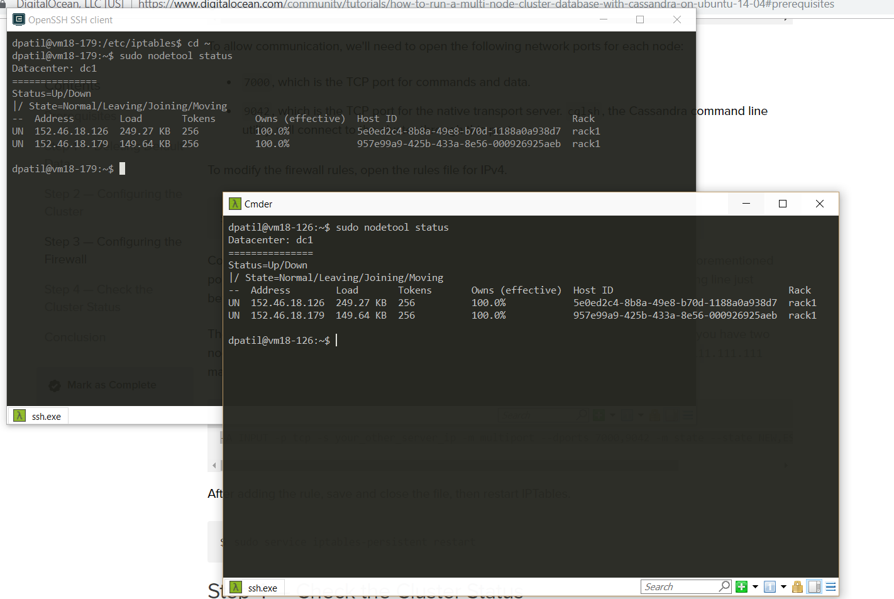
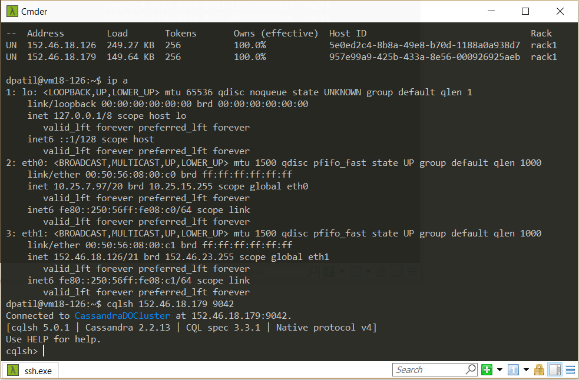
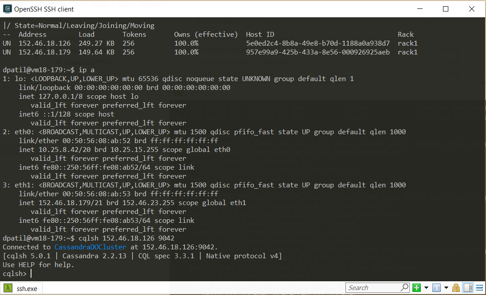
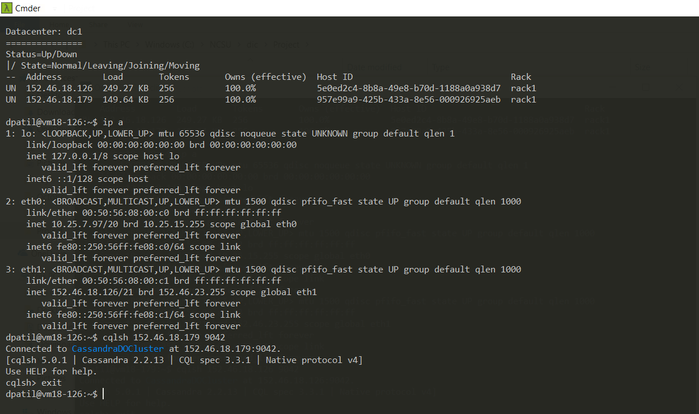
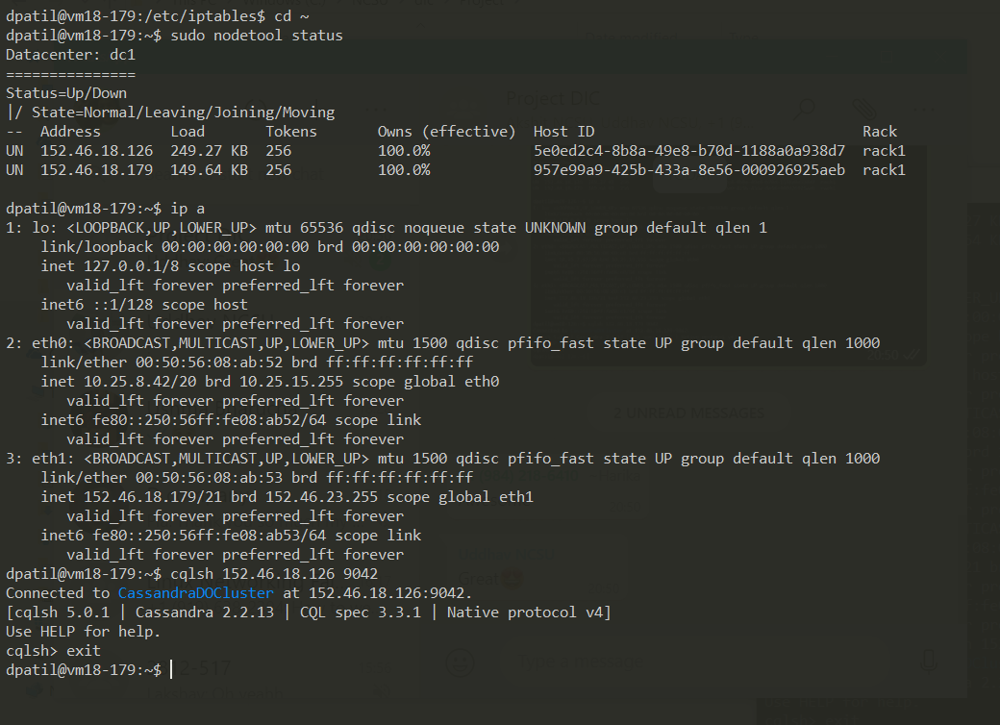

# Creating Multi-Node Cluster Database with Cassandra on Ubuntu

Cassandra is an open source distributed database system that is designed for storing and manging large amounts of data across 
commodity servers. 
It is designed to have peer-to-peer symmetric nodes instead of master node to make sure there can never be single point of failure.

Our project requires data to be distributed on multiple nodes across different locations. 
Yelp recommendation system takes distributed data to perform machine learning algorithm to provide customers with their requested queries.
Few of the advantages of using Cassandra includes high availability and fast write speed. 
Apart from these two advantages, one of the biggest factor of choosing Cassandra is CQL( Cassandra’s Query Language) 
which has resemblance to SQL which makes querying quite powerful on CSV data.

Below given are the mentioned steps to set up Cassandra DB in Multi Node cluster.

## 1. Configure Ubuntu server using mentioned steps:
    a. After Ubuntu OS installation is completed on both the machines, login to both machines as root 
       **local$ ssh root@SERVER_IP_ADDRESS**
    b. Create new user called demo # adduser demo you will be asked some additional information starting with account password. 
      For more security, select strong password.
    c. Provide root privileges to newly added user 
       **# gpasswd -a demo sudo**
    d. You can add more security to clusters by implementing following steps, but these steps are note necessary for just 
       setting up and using the server.
          i. Add public key authentication
              1. If you do not have public and private key, then you need to generate one using ssh-keygen
              2. Assuming your username is “local” Output will look like Generating public/private rsa key pair. 
                 Enter file in which to save the key 
                 **/Users/”local”/.ssh/id_rsa:**
              3. Hit enter to accept this file and path
              4. Next, you will be prompted to enter passphrase to secure your key. You may add passphrase or not.
              5. A private key “id_rsa” and public key “id_rsa.pub” will be generated in “.ssh” directory.
              6. You need to copy this public key to server.
                    a. You can use ssh-copy-id command 
                       **local$ ssh-copy-id demo@SERVER_IP_ADDRESS**
                    b. After providing password at prompt, the public key will get added to “.ssh/authorized_keys”
                    c. You can also manually install key
                    d. *Local$ cat ~/.ssh/id_rsa.pub*
                    e. You will be displayed with public key contents. Starting with “ssh-rsa”. Copy the entire content.
              7. Then go on the server, 
                 **# su - demo**
                 **# mkdir .ssh** 
                 **# chmod 700 .ssh** 
                 **# nano .ssh/authorized_keys** 
                 **exit with Ctrl+x and then Y to save** 
                 **# chmod 600 .ssh/authorized_keys** 
                 **#exit**
          ii. Configure SSH Daemon : Now that we have our new account, we can secure our server a little bit by modifying its SSH daemon
              configuration to disallow remote SSH access to the root account.
              **# nano /etc/ssh/sshd_config**
              **Modify line -> PermitRootLogin no**
              **exit with Ctrl+x and then Y to save**
          iii. Reload SSH 
              **# service ssh restart
          iv. Now login using 
              **local$ sudo ssh demo@SERVER_IP_ADDRESS**
          v. Exit using 
              **$exit
## 2. Basic Firewall and IP Tables Installation:
    a. **$sudo apt-get update**
    b. **$sudo apt-get install iptables-persistent**
    c. You can edit Firewall rules depending on your requirements
    d. After new rules are added and updated you can run below command to save the rules. 
       **$sudo service iptables-persistent save**
    e. Run below given command to repeat install procedure after rule change if necessary. 
       This command will prompt you to save current rules.
       **$sudo dpkg-reconfigure iptables-persistent**
    f. Start the service using below command. 
       **$sudo service netfilter-persistent start**
    g. Here is the link where you can find steps to add rules to your firewall. 
       Please go through this one if you want to implement any of the firewall functionality mentioned in the link.
       [Digital Ocean IPTables configuration](https://www.digitalocean.com/community/tutorials/how-to-implement-a-basic-firewall-template-with-iptables-on-ubuntu-14-04)
    h. Steps given in above link are not required for our Installation.
## 3. Install Cassandra and Run a Single-Node Cluster on Ubuntu:
    a. Install the Oracle Java Virtual Machine
        i. **$ sudo add-apt-repository ppa:webupd8team/java**
       ii. **$ sudo apt-get update**
      iii. **$ sudo apt-get install oracle-java8-set-default**
       iv. **$ java -version**
    b. Install Cassandra Database
        i. Install Cassandra from official Apache software repositories
       ii. Start adding repo so that packages are available to your system.
      iii. You can use any version you want. To specify your version in command, follow examples. 
             Use the latest release series in command version.
             For example. Version 2.2.2 will be added using 22x in command. 
             For version 2.3 use 23x. Latest release series is 3.11, so in command we can use 311x.
       iv. Run this command with desired Cassandra Version 
            **$ echo "deb http://www.apache.org/dist/cassandra/debian 22x main" | sudo tee -a     
            /etc/apt/sources.list.d/cassandra.sources.list**
        v. Then add the repo’s source using command 
            **$ echo "deb-src http://www.apache.org/dist/cassandra/debian 22x main" | sudo tee -a   
             /etc/apt/sources.list.d/cassandra.sources.list**
       vi. If you want to avoid package signature warnings add 3 public keys from Apache Software foundation associated 
            with package repositories.
      vii. These are the 3 keys that I used for my version and the respective commands. 
            **$ gpg --keyserver pgp.mit.edu --recv-keys F758CE318D77295D** 
            **$ gpg --export --armor F758CE318D77295D | sudo apt-key add -** 
            **$ gpg --keyserver pgp.mit.edu --recv-keys 2B5C1B00** 
            **$ gpg --export --armor 2B5C1B00 | sudo apt-key add -** 
            **$ gpg --keyserver pgp.mit.edu --recv-keys 0353B12C** 
            **$ gpg --export --armor 0353B12C | sudo apt-key add -**
     viii. Update the package database once again 
            **$ sudo apt-get update**
       ix. Install Cassandra using following command 
            **$ sudo apt-get install cassandra**
    c. Start Cassandra
        i. **$ sudo service cassandra start**
       ii. **$ sudo service cassandra status**
      iii. There may be a possibility that it will not run or will have any issues when configuring another instance of 
           Cassandra in cluster.
       iv. Follow these steps to ensure all the installations will work.
        v. **$sudo nano +60 /etc/init.d/Cassandra**
       vi. In file change “CMD_PATT” value to “cassandra” Line will look like this after editing 
           **CMD_PATT="cassandra"**
      vii. Reboot server with 
           **$ sudo reboot**
     viii. Then again start Cassandra service and see the status of service using commands metioned in steps i and ii.
    d. Check connectivity of cluster
        i. Check status cluster using $ sudo nodetool status
       ii. In the output UN means it is UP and NORMAL
      iii. You will be able to see list of clusters that you have configured.
       iv. At initial installation i.e. when you create only one node/installation you will be able to see only one Nodes IP and status
    e. Connecting to interactive command line cqlsh
        i. Run command 
           **$ cqlsh**
       ii. You will see it connected
      iii. To quit CLI type “exit and then Enter”
## 4. Repeat above mentionoed steps 1 to 3 to install desired number of Cassandra Nodes in cluster.
## 5. Follow steps mentioned in 6th point to Configure cluster using all installed and configured nodes.
## 6. Follow these steps to setup the cluster
      a. Delete default data using commands 
       **$ sudo service cassandra stop 
      **"$ sudo rm -rf /var/lib/cassandra/data/system/*"**
      b. Configuration of cluster:
         i. Configuration file is located in “/etc/cassandra” folder named “cassandra.yaml”
        ii. Below is the list of directives needed to modify to set-up multi-node Cassandra cluster
       iii. cluster_name: This is the name of your cluster.
        iv. -seeds: This is a comma-delimited list of the IP address of each node in the cluster.
         v. listen_address: This is IP address that other nodes in the cluster will use to connect to this one. 
            It defaults to localhost and needs changed to the IP address of the node.
        vi. rpc_address: This is the IP address for remote procedure calls. It defaults to localhost. 
            If the server's hostname is properly configured, leave this as is. Otherwise, change to server's IP address or the loopback             address
       vii. endpoint_snitch: Name of the snitch, which is what tells Cassandra about what its network looks like. 
            This defaults to SimpleSnitch, which is used for networks in one datacenter. In our case, we'll change it to 
            GossipingPropertyFileSnitch, which is preferred for production setups.
      viii. auto_bootstrap: This directive is not in the configuration file, so it has to be added and set to false. This makes new 
            nodes automatically use the right data. It is optional if you're adding nodes to an existing cluster, but required when    
            you're initializing a fresh cluster, that is, one with no data.
      c. Open cassandra.yaml using 
         **$ sudo nano /etc/cassandra/cassandra.yaml**
      d. Update mentioned directives.
      e. At the end add auto_bootstrap directive as 
         **auto_bootstrap: false**
      f. Now Configure Firewall for Cassandra cluster
         i. Start Cassandra 
           **$ sudo service cassandra start**
        ii. If you check the status of the cluster, you'll find that only the local node is listed, because it's not yet able to 
            communicate with the other nodes. 
            **$ sudo nodetool status**
       iii. To allow communication, we'll need to open the following network ports for each node: 
            7000: TCP port for commands and data. 
            9042: TCP port for the native transport server. Cassandra command line utility “cqlsh”, will connect to the cluster through 
                  this port.
        iv. To modify rules open ipv4 rule file 
            **$ sudo nano /etc/iptables/rules.v4**
         v. Copy below line for each node in your cluster. Mention “ip_address_of_other_server” in the command. Each server in cluster  
            requires new line to be added to rule table
            **-A INPUT -p tcp -s your_other_server_ip -m multiport --dports 7000,9042 -m state --state NEW,ESTABLISHED -j ACCEPT**
        vi. Now restart iptables $ sudo service iptables-persistent restart
      g. Cluster status now: We completed procedure to add nodes in multi-cluster setup
      h. We can verify using command 
        **$ sudo nodetool status**
      i. Check CLI for server node 
        **$ cqlsh “your_server_ip” 9042** 
        **cqlsh> exit**
## References
   (https://www.digitalocean.com/community/tutorials/how-to-run-a-multi-node-cluster-database-with-cassandra-on-ubuntu-14-04)
   (https://dev-notes.eu/2016/08/persistent-iptables-rules-in-ubuntu-16-04-xenial-xerus/)
## Screenshots of installation: 
   Below are the images of setup that we created on VCL machines.
   
   
   
   
   
